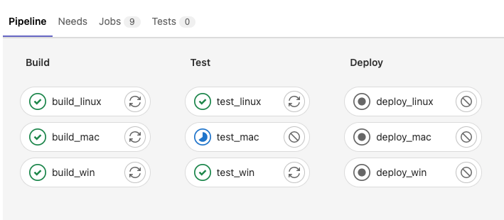
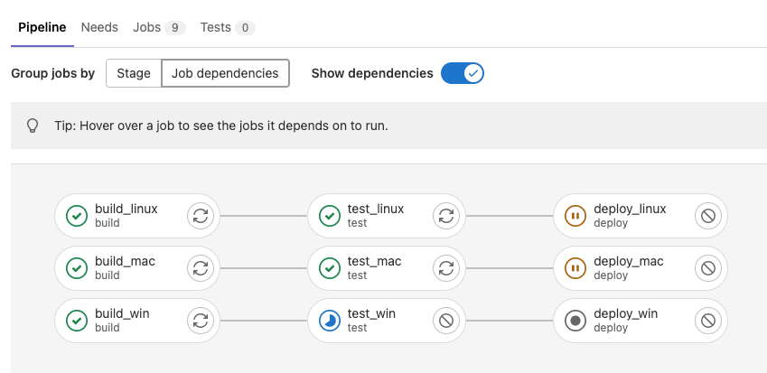
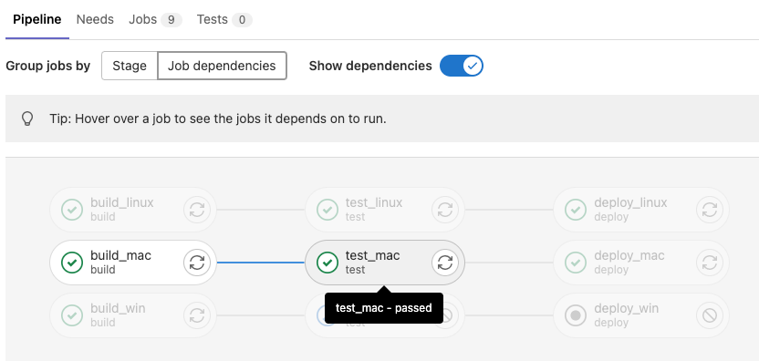
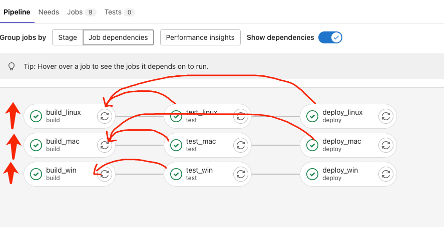

> # needs & dependencies

# 作业依赖 - needs

默认情况下，所有 Job 按照 stages 规定的顺序执行，上一个 stage 结束后，才能执行下一个 stage

但对于一些并行构建模式，无需等待上一个阶段的所有作业完成，就可以继续执行下一个构建；这样可以大大缩短构建时间。



`如上图所示，Test 未执行完，Deploy 不会执行`

可以通过添加 `needs` 关键字，打破默认执行顺序；





# 制品依赖 - dependencies

默认情况下，作业会下载上一级作业的全部制品。可以通过 `dependencies` 自定义下载哪些制品。

如示例所示，win 平台的测试和发布，仅需下载 win build 制品接口。




# 补充学习

`artifacts` 关键字，定义了制品上传参数，合理利用可以有效在作业间传递制品，实现缓存的效果。

```yaml
build_win:
  stage: build
  script:
    - sleep 10
    - touch ./build/win.txt
    - echo "Build Windows Packs"
  artifacts:
    paths:            # 指定哪些目录被打包上传
      - ./build/
    exclude:          # 排除目录或文件,支持通配符
      - .gitkeep
    expire_in: 1 days # 制品过期时间，默认配置 30 days
```


> 过期时间支持的格式
```text
'42'
42 seconds
3 mins 4 sec
2 hrs 20 min
2h20min
6 mos 1 day
47 yrs 6 mos and 4d
3 weeks and 2 days
never
```