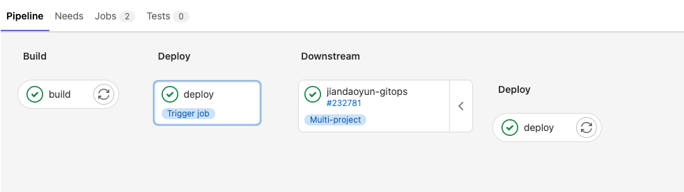

> # trigger

trigger 关键字可以触发其他流水线，这在部署复杂项目时，灵活度非常高。其使用原理类似于多进程中的父子进程。

trigger 可以触发其他项目的流水线，也可以触发本地子流水线。


# 触发多项目流水线
```yaml
Job1:
  trigger: MyGroup/MyProject
```




# 触发本地子流水线

```yaml

variables:
  IMAGE: "DEPLOY_IMAGE"

Job1:
  trigger:
    include:
      - local: "deploy/deploy.windows.yaml"
      - local: "deploy/deploy.linux.yaml"
    strategy: depend
    forward:
      yaml_variables: true  # 默认 true
      pipeline_variables: false # 默认 false
```

strategy: 控制流水线是否等待，其值可以为空或 depend； depend 代表父流水线等待子流水线完成才结束。

forward：控制哪些信息可以传递给子流水线；

yaml_variables: yaml 文件中配置的环境变量可以传递给子流水线
pipeline_variables: 手动执行或者定时执行的流水线变量，可以传递给子流水线。
