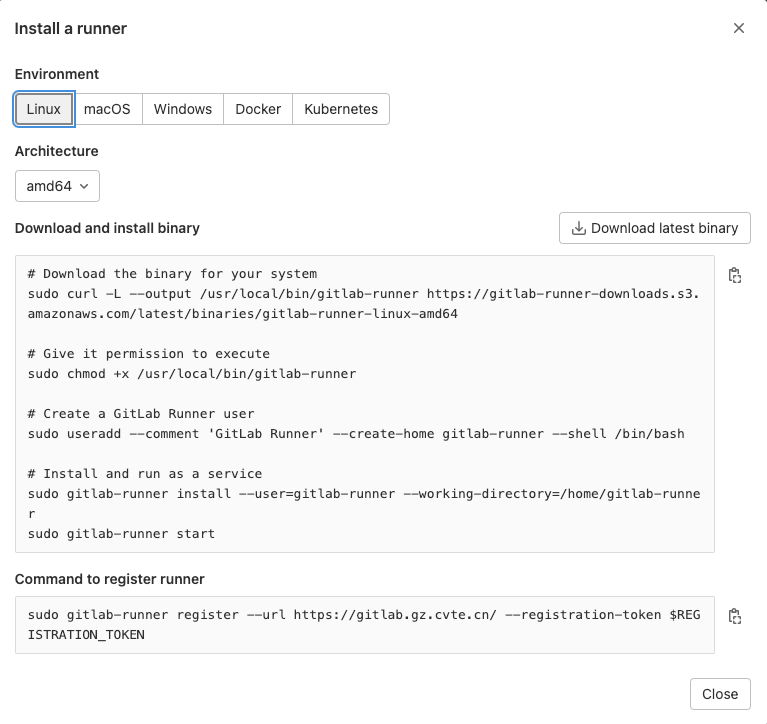
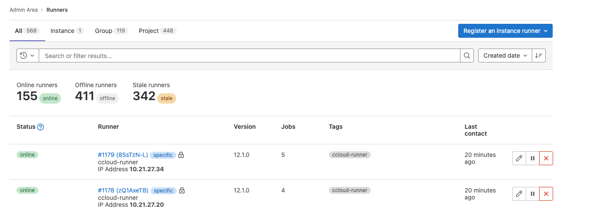
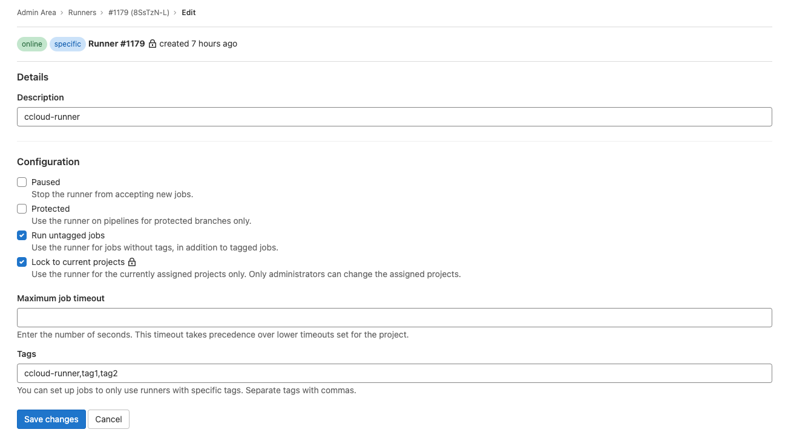

>  # Gitlab Runner
---

# 1.Runner 是什么

Gitlab CI 是一套开源的流水线系统，而 Gitlab Runner 是这套流水线系统的执行器，
用于运行作业并将结果发送给 Gitlab。Gitlab Runner 使用 Go 编写，可以作为单个
二进制文件运行。

Gitlab Runner 有三种类型:

* shared: 共享型，可运行整个 Gitlab 平台所有项目的作业。
* group: 组内共享型，可运行特定组内所有项目的作业
* specific: 运行特定项目的作业

# 2.Runner 部署方式

> Gitlab 项目 -> settings -> CI/CD -> Runners -> [Show Runner Installation Instructions](https://gitlab.gz.cvte.cn/ci/learning/-/settings/ci_cd)



# 3.Rrunner 工作流程

```mermaid
flowchart TD
    start -> stop
```

# 3.为 Runner 打标签



