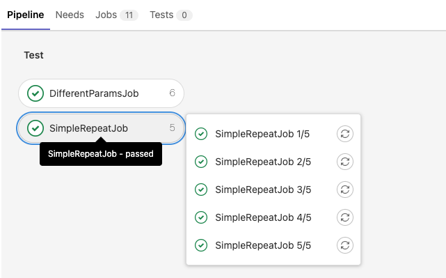
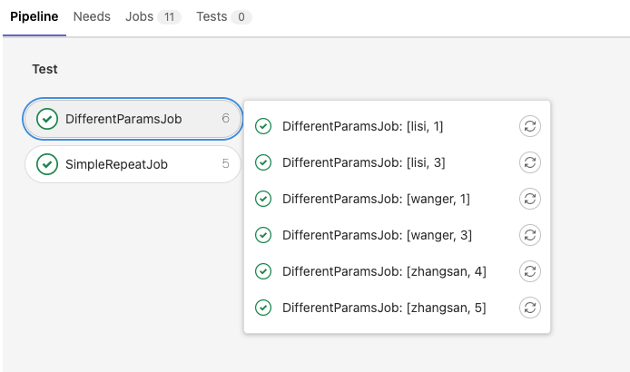

> # parallel

# 并行执行 - parallel

对于非常耗时的操作，比如要执行 1H，可以把一个长任务拆分为多个短任务，通过并行处理加速。


parallel 支持两种模式：简单循环和矩阵参数

# 简单循环

```yaml
# 简单循环作业，最大不允许超过 50
SimpleRepeatJob:
  script: echo "SimpleJob Run"
  parallel: 5
```


# 矩阵参数

```yaml
# 单任务执行多次，每次参数不同
DifferentParamsJob:
  script:
    - echo "Username ${NAME}, sleep ${SLEEP}"
    - sleep ${SLEEP}
  parallel:
    matrix:
      - NAME: "zhangsan"
        SLEEP:
          - 5
          - 4
      - NAME: ["lisi", "wanger"]
        SLEEP: [3, 1]
```

