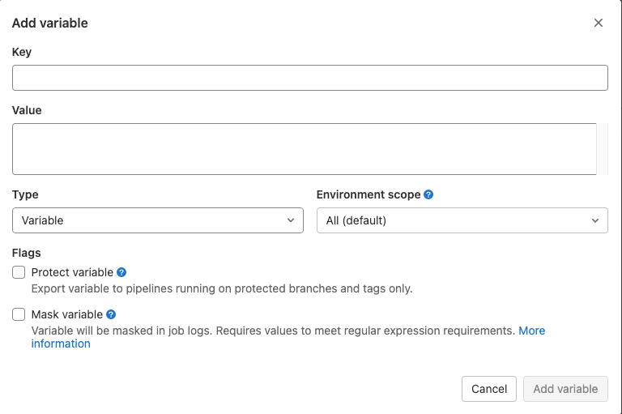

> # variables

# 何处定义变量

* 预设变量
* .gitlab-ci 流程中配置
* 项目后台配置
* 手动运行时配置

# 变量类型

> Variable: 普通变量

普通变量映射到 Runner 的环境变量中

> File: 文件类型

文件类型映射到 Runner 的文件中

# 变量标签

> Protect variable

只在保护分支或保护 Tag 才导出

> Mask variable

在 runner 日志中以 * 号出现，可以保护敏感数据。

# 变量优先级