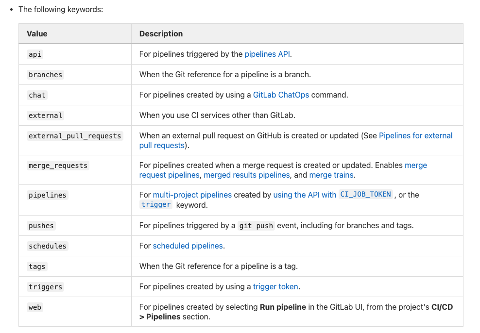

> # 条件限定

# only / except

only: 仅在满足条件的情况下执行

except: 除规定的条件外，都执行

[参考文档](https://gitlab.gz.cvte.cn/help/ci/yaml/index.md#only--except)



# rules

rules 是 only/except 的加强版，可以实现 only/except 的所有功能，但他们不能出现在同一Job 中。

rules 的子命令如下：

```text
if
changes
exists
allow_failure
variables
when
```
