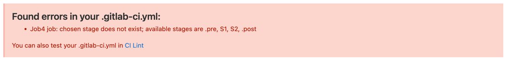

> # Job & Stages


# Job

Job 是 Gitlab CI 中的最小执行单元，如果仅定义多个 Job，它们之间是并行关系，
即 Job 的执行不分先后顺序。

# Stages

Stages 是全局关键字，定义当前流水线有几个阶段，其值为数组类型。每个阶段的执行
顺序就是数组的定义顺序。

每个 Stage 可以包含多个 Job，在 Stage 内部，Job 是并行的。

```yaml
# 默认 stages
stages:
  - .pre
  - build
  - test
  - deploy
  - .post
```

默认 stages 可以不用定义而直接使用。默认情况下，`.pre` 最优先执行，`.post` 最后一步执行。

> stage 和 Job 名称，可以使用中文定义，但不建议使用中文。


# 小技巧

## 1. 合理利用默认 stages，可以减少配置清单，但会降低可读性；

## 2. 尽量不要在 Job 的 script 中编写复杂脚本，可以将他们统一放置到脚本目录

## 3. Job 名称以 `.` 开始，则标记该 Job 隐藏不执行，但它仍可被其他 Job 引用

## 4. 如存在不属于任何 stage 的 Job，则无法会报错

